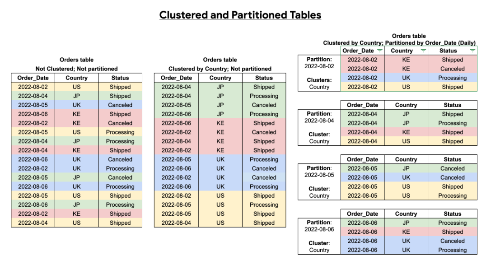

## Module 3 Homework

<b><u>Important Note:</b></u> <p> For this homework we will be using the Yellow Taxi Trip Records for **January 2024 - June 2024 NOT the entire year of data** 
Parquet Files from the New York
City Taxi Data found here: </br> https://www.nyc.gov/site/tlc/about/tlc-trip-record-data.page </br>
If you are using orchestration such as Kestra, Mage, Airflow or Prefect etc. do not load the data into Big Query using the orchestrator.</br> 
Stop with loading the files into a bucket. </br></br>

## BigQuery Setup:
Create an external table using the Yellow Taxi Trip Records. </br>
Create a (regular/materialized) table in BQ using the Yellow Taxi Trip Records (do not partition or cluster this table). </br>
</p>

The BQ commands for these are:
```sql
CREATE OR REPLACE EXTERNAL TABLE `<project_name>.<dataset_name>.yellow_taxi_ext`
OPTIONS(
    FORMAT = 'PARQUET',
    URIS = ['gs://<bucket_name>/*.parquet']
);
```
and 
```sql
CREATE OR REPLACE TABLE `<project_name>.<dataset_name>.yellow_taxi`
AS
SELECT *
FROM `<project_name>.<dataset_name>.yellow_taxi_ext`;
```
respectively.

## Question 1:
Question 1: What is count of records for the 2024 Yellow Taxi Data?

Answer: 20,332,093. We can see this by clicking the table on BQ and checking the details column.


## Question 2:
Write a query to count the distinct number of PULocationIDs for the entire dataset on both the tables.</br> 
What is the **estimated amount** of data that will be read when this query is executed on the External Table and the Table?

Answer: 0 MB for the External Table and 155.12 MB for the Materialized Table

The queries are:
```sql
SELECT count(distinct PULocationID)
FROM `<project_name>.<dataset_name>.yellow_taxi_ext`;

SELECT count(distinct PULocationID)
FROM `<project_name>.<dataset_name>.yellow_taxi`;
```
If we highlight the query on the BQ query console, we can see the estimated amount of data that will be read during the query. 

Note: BQ cannot estimate amount of data read for external tables.

## Question 3:
Write a query to retrieve the PULocationID from the table (not the external table) in BigQuery. Now write a query to retrieve the PULocationID and DOLocationID on the same table. Why are the estimated number of Bytes different?

Answer: BigQuery is a columnar database, and it only scans the specific columns requested in the query. Querying two columns (PULocationID, DOLocationID) requires 
reading more data than querying one column (PULocationID), leading to a higher estimated number of bytes processed.

The queries are below, and the estimated amount of data processed are 155.12 MB and 310.24 MB respectively.
```sql
SELECT PULocationID
FROM `<project_name>.<dataset_name>.yellow_taxi`;

SELECT PULocationID, DOLocationID
FROM `<project_name>.<dataset_name>.yellow_taxi`;
```


## Question 4:
How many records have a fare_amount of 0?

Answer: 8,333, obtained using the query:

```sql
SELECT COUNT(*)
FROM `<project_name>.<dataset_name>.yellow_taxi`
WHERE fare_amount = 0;
```

## Question 5:
What is the best strategy to make an optimized table in Big Query if your query will always filter based on tpep_dropoff_datetime and order the results by VendorID (Create a new table with this strategy)

Answer: Partition by tpep_dropoff_datetime and Cluster on VendorID

Generally, we want to partition by a field that we will filter by, and cluster on a field that we will order by. The following image from the BQ guide illustrates why this is the case:



As the image shows, when we partition by the column we want to filter by (e.g. the date), we only need to process the relevant partition(s) instead of the entire table. On the other hand, clustering maintains the sort order within a partition, so it makes `order by` queries more efficient.

Note: to create this table, we can use the following:
```sql
CREATE OR REPLACE TABLE `<project_name>.<dataset_name>.yellow_taxi_optimized`
PARTITION BY DATE(tpep_dropoff_datetime)
CLUSTER BY VendorID
AS
SELECT *
FROM `<project_name>.<dataset_name>.yellow_taxi`;
```

## Question 6:
Write a query to retrieve the distinct VendorIDs between tpep_dropoff_datetime
2024-03-01 and 2024-03-15 (inclusive)</br>

Use the materialized table you created earlier in your from clause and note the estimated bytes. Now change the table in the from clause to the partitioned table you created for question 5 and note the estimated bytes processed. What are these values? </br>

Answr: 310.24 MB for non-partitioned table and 26.84 MB for the partitioned table

The queries are:
```sql
SELECT distinct VendorID
FROM `<project_name>.<dataset_name>.yellow_taxi`
WHERE tpep_dropoff_datetime BETWEEN '2024-03-01' AND '2024-03-16';

SELECT distinct VendorID
FROM `<project_name>.<dataset_name>.yellow_taxi_optimized`
WHERE tpep_dropoff_datetime BETWEEN '2024-03-01' AND '2024-03-16';
```

Having a good partitioning & clustering strategy can result in massive cost savings at scale.

## Question 7: 
Where is the data stored in the External Table you created?

Answer: GCP Bucket

## Question 8:
It is best practice in Big Query to always cluster your data:

Answer: False, as there is some overhead associated with clustering (e.g. to maintain the order when new data is inserted). Clustering is not recommended when the dataset is small, as the overhead will be relatively significant.

## (Bonus: Not worth points) Question 9:
No Points: Write a `SELECT count(*)` query FROM the materialized table you created. How many bytes does it estimate will be read? Why?

Answer: 0 bytes. This is because BQ optimizes this query by obtaining the number of records directly from the metadata.